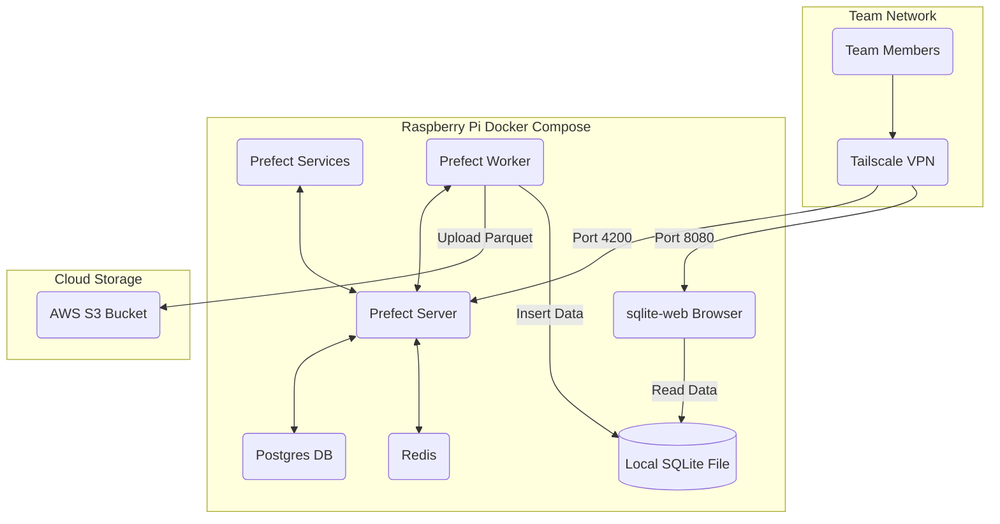

# 트렌드 분석 작업 실행용 prefect 서버

기술 블로그의 rss를 기반으로 업계 트렌드를 파악하기 위한 prefect 서버입니다.

기존에 airflow로 작업하던 프로젝트를 배포 환경의 메모리 부족으로 prefect로 이전하였습니다.

prefect server, worker는 개인 라즈베리 파이에 docker compose로 배포 중입니다. (메타 db, 메시지 브로커 포함)

